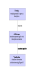
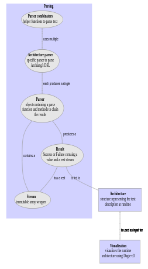

Archlang
========

Archlang is a small utility application that allows you to _describe_ a
graph-like structure (such as a software architecture diagram, hence _archlang_)
using a small DSL, where after this structure is visualized. The layout
algorithm & visualization itself is provided by
[dagre-d3](https://github.com/cpettitt/dagre-d3/wiki).

The parser combinator code is originally taken from this
[blog](https://medium.com/@chetcorcos/introduction-to-parsers-644d1b5d7f3d) and
modified / extended to fit my needs and work with TypeScript. There are some
limitations as explained in the article, but it seems to provide everything I
need, so I kept it like this instead of using a full-fledged library.

Run
---

You can run the application by starting npm (`npm start`) and running some
web server (e.g. live-server). Since I am not completely aware of how an
idiomatic node application setup should look like, and this just a pet project
is, I simply included the dependencies in the `/lib` directory and ignore the
`npm` error messages.

Test
----

Testing can be done similarly to running the code. Simply follow the
instructions from _Run_ above and paste `/tests/spec.html` behind the URL.

Features
--------

Currently _ArchLang_ provides two features; the ability to interpret some
graph-like description, and a way to visualize it.

### Graph DSL

* Components are created using an ID, a title, a description (which can be
  empty), and potentially a color (but it can be ommited):
  `n1 "title" "description" red`

* Connecters connect two components, have a description (which again can be
  empty), and potentially a color (which again can be ommited):
  `n1 --"some description"--> n2 blue`

* Archlang uses C-style comments: `// So you can annotate your graph`

* Clusters contain sub graphs and are similar to components:
  ```
  cluster c1 "Cluster title" "Cluster desciption" gray
  ... // nodes and edges
  end
  ```

*  Whitespace and newlines are ignored to improve readability:
   ```
   n1 "some node" "some description"

   cluster c1
       n2 "another node" ""
   end

   n1 --""--> c1
   ```

* Layout styles for nodes, edges, and clusters:
  ```
  // A blue, rectangle shaped cluster node
  |cluster| c1 blue

     (n1) "node" "with circular shape and red color" red
     |n2| "node2" "rectanle and gray" gray

     n1 --"dark grey connector"--> n2 dark-gray
  end
  ```

### Visualization

```
// You can use C-style comments to annotate the description
// This description is a representation of the actual code

// You can create a clusters with a shape, id, title, and description
// This will create a blue rectangle.

cluster |c1| "Parsing" "everything needed to parse a description" blue

    // Every node also has a shape, id, title, and description.
    // Each of these will create a ellipse node (in gray by default).
    (p1) "Parser combinators" "helper functions to parse text"
    (p2) "Architecture parser" "specific parser to parse Archlang's DSL"
    (p3) "Parser" "object containing a parse function and methods to
          chain the results"
    (p4) "Stream" "immutable array wrapper"
    (p5) "Result" "Success or Failure containg a value and a rest
                   stream"

    // Edges are created using a source and target node and a
    // description (which may be empty).
    p3 --"contains a"--> p4
    p3 --"produces a"--> p5
    p1 --"uses multiple"--> p2
    p2 --"each produces a single"--> p3
    p5 --"has a rest"--> p4
    p5 --"is fed to"--> c2
end

cluster |c2| "Architecture" "structure representing the text description
              at runtime" blue
    (a1) "Architecture" "Overarching object consisting of components and
          connectors"
    (a2) "Component" "Node with an id, title, description, shape, and
          color"
    (a3) "Connector" "Connects two components, possibly has a label and
          color"

    a1 --"contains multiple"--> a2
    a1 --"contains multiple"--> a3
    a1 --"is used as source for"--> c3
end

// When no shape is given it will default to a rectangle.
cluster c3 "Visualization" "visualizes the runtime architecture using
            Dagre-d3" blue
    (v1) "DagreGraph" "wrapper around dagre-d3 functionality"
    (v2) "ClusterManager" "manages expanding and collapsing of
          components with sub-architectures"
    (v3) "Renderer" "renders and updates the visualization"

    v1 --"uses"--> v2
    v1 --"uses"--> v3
end

c1 --"results in"--> c2
c2 --"is used as input for"--> c3
```

The description above leads to visualization below.



And if you click the _parsing_ block it will expand:


